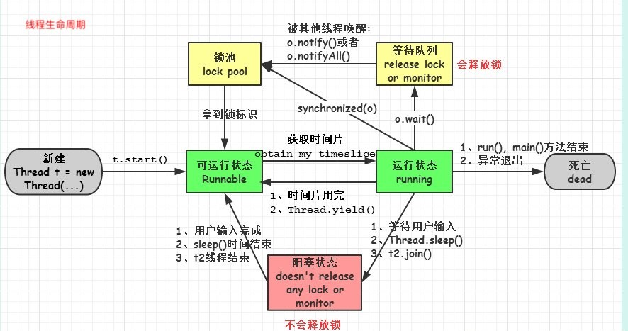

# 线程基础知识

## 线程的生命周期



### 线程的生命周期大致分为5个阶段

- New
- Runnable
- Running
- Blocked
- Terminated/Dead

#### 1.new状态

当我们用关键字new创建一个Thread对象时，此时它并不处于执行状态，因为没有调用start()方法启动该线程，name线程的new状态，准确地说，它只是Thread对象的状态，因为在没有start之前，该线程根本不存在，与你用关键字new创建一个普通的java对象没有什么区别。

new状态通过start()方法进入runnable状态

#### 2.Runnable状态

线程的运行与否与进程一样都要听令于CPU的调度，那么我们把这个中间状态称为可执行状态（Runnable），也就是说它具备执行的资格，但是并没有真正地执行而是在等待CPU的调度。

runnable的线程只能意外终止或进入running转态

#### 3.Running状态

一旦CPU通过轮询或者其它方式从任务可执行队列中选中了线程，那么他才能真正地执行自己的逻辑代码，需要说明的是一个正在running状态的线程事实上也是runnable的，但是反过来则不成立。

在该状态中，线程的状态可以发生如下的状态转换：

- 直接进入terminated/dead状态，比如调用jdk已经不推荐使用的stop方法或者判断某个逻辑标识
- 进入blocked状态，比如调用了sleep，或者wait方法而加入waitSet中。
- 进行某个阻塞的IO操作，比如因网络数据的读写而进入了blocked状态。
- 获取某个锁资源，从而加入到该锁的阻塞队列中而进入blocked状态
- 由于CPU的调度器轮询使该线程放弃执行进入runnable状态
- 线程主动调用yield方法，放弃CPU执行权，进入runnable状态。

#### 4.Blocked状态

blocked状态可以切换至如下几个状态

- 直接进入terminated/dead状态，比如调用jdk已经不推荐使用的stop方法或者意外死亡（JVM Crash）
- 线程阻塞的操作结束，比如读取了想要的数据字节进入到running状态。
- 线程完成了指定时间的休眠，进入到了runnable状态
- wait中的线程被其他线程notify/notifyall唤醒，进入runnable状态
- 线程获取到了某个锁资源，进入runnable状态
- 线程在阻塞过程中被打断，比如其他线程调用了interrupt方法，进入runnable状态

##### 5.Terminated/Dead

- terminated/dead是一个线程的最终状态，在该状态中线程将不会切换到其他任何状态，线程进入terminated/dead状态，意味着该线程的整个生命周期都结束了，以下这些情况将是线程进入terminated/dead状态
- 线程运行正常结束，结束生命周期
- 线程运行出错意外结束
- JVM Crash，导致所有线程都结束


### 线程的start方法剖析

start()方法源码如下：

```java
public synchronized void start() {
        /**
         * This method is not invoked for the main method thread or "system"
         * group threads created/set up by the VM. Any new functionality added
         * to this method in the future may have to also be added to the VM.
         *
         * A zero status value corresponds to state "NEW".
         */
        if (threadStatus != 0)
            throw new IllegalThreadStateException();

        /* Notify the group that this thread is about to be started
         * so that it can be added to the group's list of threads
         * and the group's unstarted count can be decremented. */
        group.add(this);

        boolean started = false;
        try {
            start0();
            started = true;
        } finally {
            try {
                if (!started) {
                    group.threadStartFailed(this);
                }
            } catch (Throwable ignore) {
                /* do nothing. If start0 threw a Throwable then
                  it will be passed up the call stack */
            }
        }
    }
```

start方法的源码很简单，其最核心的部分就是start0()这个方法，也就是JNI方法：

```java
private native void start0();
```

也就是说在start()方法中会调用start0()这个方法，那么重写的那个run方法何时被调用呢？

JDK官方文档：# Causes this thread to begin execution; the Java Virtual Machine calls the <code>run</code> method of this thread.

上面这句话的意思是：在开始执行这个线程时，JVM将会调用该线程的run方法，换言之，run方法是被JNI方法start()调用的，仔细阅读start的源码将会总结出如下几个知识要点：

- Thread被构造后的NEW状态，事实上threadStatus这个内部属性为0
- 不能两次启动Thread，否则就会出现IllegalStateException异常。
- 线程启动后将会被加入到一个ThreadGroup中，
- 一个线程生命周期结束，也就是到了terminated状态，再次调用start方法是不允许的，也就是说terminated状态是没办法回到runnable/running状态的

### 模板设计模式在Thread中的应用

Thread的run和start就是一个比较典型的模板方法模式，父代码编写算法结构代码，子类实现逻辑细节

```java
package com.xwl.concurrent;

/**
 * @Author: xwl
 * @Date: 2019/6/17 22:00
 * @Description: 设计模式--模板方法模式
 * Thread的run和start就是一个比较典型的模板方法模式，父代码编写算法结构代码，子类实现逻辑细节
 * 下面通过一个简单的例子来看看模板方法模式
 *
 * print方法类似于Thread的start方法，而wrapPrint则类似于run方法，
 * 这样做的好处是，程序结构由父类控制，并且是final修饰的，不允许被重写
 * 子类只需要实现想要的逻辑任务即可
 */
public class TemplateMethod {

	public final void print(String message) {
		System.out.println("################");
		wrapPrint(message);
		System.out.println("################");
	}

	protected void wrapPrint(String message) {

	}

	public static void main(String[] args) {
		TemplateMethod t1 = new TemplateMethod() {
			@Override
			protected void wrapPrint(String message) {
				System.out.println("*" + message + "*");
			}
		};
		/*
		 * ################
		 * *hello thread*
		 * ################
		 */
		t1.print("hello thread");

		TemplateMethod t2 = new TemplateMethod() {
			@Override
			protected void wrapPrint(String message) {
				System.out.println("*" + message + "*");
			}
		};
		/*
		 * ################
		 * *hello world*
		 * ################
		 */
		t2.print("hello world");
	}
}
```

模拟银行出号机出号

```java
package com.xwl.concurrent;

/**
 * @Author: xwl
 * @Date: 2019/6/25 20:40
 * @Description: 假设某银行大厅有4台出号机，下面使用程序模拟出号，假设每天最多出号50
 * 运行结果：
 * 柜台：2号出号机当前的号码是：1
 * 柜台：1号出号机当前的号码是：1
 * 柜台：4号出号机当前的号码是：1
 * 柜台：3号出号机当前的号码是：1
 * 柜台：4号出号机当前的号码是：2
 *
 * 之所以出现这个问题，根本原因是因为每一个线程的逻辑执行单元都不一样，我们新建了4个TicketWindow线程，他的票号都是从1到50
 * 并不是我们期望的4台机器交互执行，要解决这个问题，无论TicketWindow被实例化多少次，只需要保证index是唯一的即可，
 * 我们立即会想到使用static修饰index
 * private static int index = 1;
 * 就能得到我们想要的结果
 * 但是极其不推荐这样做，因为static修饰的变量生命周期很长。。。
 */
public class TicketWindow extends Thread {
	// 柜台名称
	private final String name;

	// 最多50个号
	private static final int MAX = 50;

//	private int index = 1;

	private static int index = 1;

	public TicketWindow(String name) {
		this.name = name;
	}

	@Override
	public void run() {
		while (index <= MAX) {
			System.out.println("柜台：" + name + "当前的号码是：" + index++);
		}
	}

	public static void main(String[] args) {
		TicketWindow t1 = new TicketWindow("1号出号机");
		t1.start();

		TicketWindow t2 = new TicketWindow("2号出号机");
		t2.start();

		TicketWindow t3 = new TicketWindow("3号出号机");
		t3.start();

		TicketWindow t4 = new TicketWindow("4号出号机");
		t4.start();
	}
}
```


### Runnable接口的引入以及策略模式在Thread中的使用

Runnable的职责：

Runnable接口非常简单，只定以了一个无参数无返回值的run方法

```java
package java.lang;

@FunctionalInterface
public interface Runnable {
    void run();
}


```

Thread的run()方法源码:

```java
public class Thread implements Runnable {
    。。。
    private Runnable target;
    。。。
    public void run() {
        // 如果构造Thread时传递了Runnable，则会执行runnable的run方法
        if (this.target != null) {
            this.target.run();
        }
        // 否则需要重写Thread类的run方法
    }
    。。。
}
```

**注意1**：我们常说创建线程有两种方式，一种是创建一个Thread，一种是实现Runnable接口，这种说法不是很严谨。准确的将，创建线程只有一种方式那就是构造Thread类，而实现线程的执行单元run()方法则有两种方式，第一种就是重写Thread的run方法，第二种是实现Runnable接口的run方法，并将Runnable实例用作构造Thread的参数。

**注意2**：重写Thread类的run方法和实现Runnable接口的run方法还有一个很重要的不同，那就是Thread类的run方法是不能共享的，也就是说A线程不能把B线程的run方法当作自己的执行单元，而使用Runnable接口则很容易就能实现这一点，使用同一个Runnable的实例构造不同的Thread实例。

### 策略模式在Thread中的使用

无论是Runnable的run方法，还是Thread类本身的run方法（事实上Thread类也是实现了Runable接口）都是想将线程的控制本身和业务逻辑的运行分离开来，达到职责分明、功能单一的原则，这一点与GoF设计模式中的策略设计模式很相似

实现Runnable接口模拟出号：

```java
package com.xwl.concurrent;

/**
 * @Author: xwl
 * @Date: 2019/6/25 21:31
 * @Description: 实现Runnable接口，模拟银行出号
 * 注意：不管是以这种方法还是用TicketWindow中使用 private static int index = 1;这种方法
 * 这两个程序多运行几次或者MAX值从50增贾到100,500甚至更大，都会出现一个号码出现多次的情况，也会出现某个号码不会出现的情况
 * 更会出现超过最大值的情况，这是因为共享支援index存在线程安全问题！！！
 */
public class TicketWindowRunnable implements Runnable {

	// 最多50个号
	private static final int MAX = 50;

	private int index = 1;


	@Override
	public void run() {
		while (index <= MAX) {
			System.out.println(Thread.currentThread() + "的号码是：" + index++);
			try {
				Thread.sleep(100);
			} catch (InterruptedException e) {
				e.printStackTrace();
			}
		}
	}

	public static void main(String[] args) {
		final TicketWindowRunnable task = new TicketWindowRunnable();

		Thread window1 = new Thread(task, "1号窗口");
		Thread window2 = new Thread(task, "2号窗口");
		Thread window3 = new Thread(task, "3号窗口");
		Thread window4 = new Thread(task, "4号窗口");

		window1.start();
		window2.start();
		window3.start();
		window4.start();
	}
}

```

